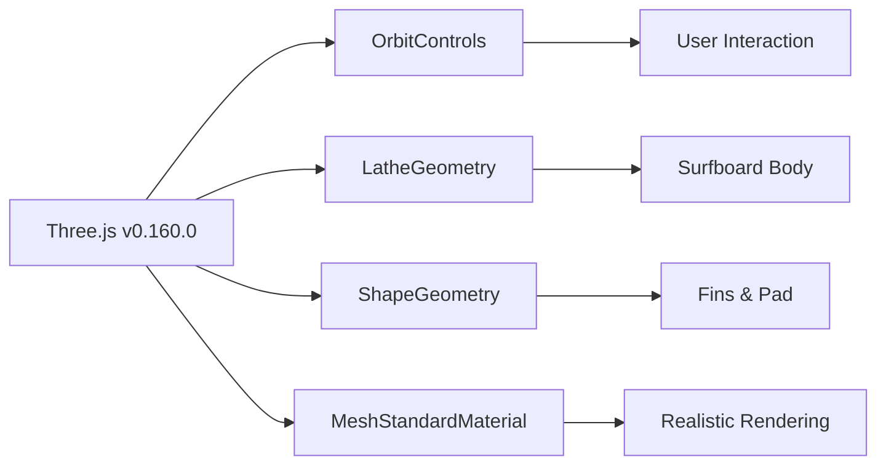

# 🏄‍♂️ Surfboard 3D Reconstruction

## A Three.js Tribute to Wave-Riding Geometry

---

### 🌊 Overview

This project is a **3D recreation of a real-world surfboard** using Three.js, built as a single self-contained HTML file. What started as a photograph of a surfboard became a fully interactive 3D model you can orbit, zoom, and inspect from every angle—no strings attached, just pure WebGL magic.

The surfboard is reconstructed using basic geometries (BoxGeometry, SphereGeometry, LatheGeometry, and ShapeGeometry) combined with realistic materials, lighting, and shadows. The result is a visually faithful representation that captures the essence of a classic surfboard: elongated foam core, subtle deck pad, fins, stringer, leash plug, and rail bands.

---

### ✨ Features

| Feature | Description |
|---------|-------------|
| **🖱️ Interactive Controls** | Full OrbitControls support—drag to rotate, scroll to zoom |
| **🌞 Dynamic Lighting** | Multi-light setup (key, fill, rim, back) with realistic shadows |
| **🏄 Authentic Shape** | Custom LatheGeometry profile for smooth nose-to-tail contour |
| **🔧 Detailed Components** | Fins (thruster setup), deck pad, stringer, leash plug, rail bands |
| **🎨 Material Quality** | MeshStandardMaterial with proper roughness/metalness values |
| **📦 Self-Contained** | Single HTML file with ES module imports—no build tools needed |
| **⚡ Performance** | Optimized geometry with shadow mapping and anti-aliasing |

---

### 🚀 Quick Start

1. **Clone or download** this repository
2. **Open `index.html`** in any modern browser (Chrome, Firefox, Edge, Safari)
3. **Explore** the surfboard in 3D!

That's it. No server required (though a local server is recommended for best module loading).

```bash
# If you have Python 3
python3 -m http.server 8000

# If you have Node.js
npx serve .
```

---

### 🧠 How It Works

#### Geometry Construction
The surfboard is built using a **LatheGeometry** with a custom half-profile that defines the board's cross-section from nose to tail. The profile is then flattened along the Z-axis to achieve the characteristic surfboard width-to-thickness ratio.

```javascript
// Profile points define the board's shape
const profile = [
  [0.0, 0.0],    // nose tip
  [0.02, 0.12],  // rising curve
  // ... more points
  [1.0, 0.0]     // tail tip
];
```

#### Material Stack
- **Board Body**: Cream/white foam with subtle roughness (0.5) and low metalness (0.05)
- **Deck Pad**: Dark, high-roughness traction pad near the tail
- **Fins**: Metallic blue-grey with slight sheen
- **Stringer**: Warm wood-tone line down the center

#### Lighting Design
A four-point lighting system creates depth and realism:
- **Key Light**: Warm directional light from upper-right
- **Fill Light**: Cool blue fill from the left
- **Rim Light**: Backlight for edge definition
- **Ambient Light**: Soft global illumination

---

### 🎯 Design Decisions

| Decision | Rationale |
|----------|-----------|
| **LatheGeometry over Extrude** | Better control over smooth, organic surfboard contours |
| **Scale factor of 0.3 on Z** | Flattens the revolved shape to surfboard proportions |
| **Three-fin setup** | Matches modern thruster configuration common in shortboards |
| **Shadow catcher plane** | Grounds the model visually without distracting geometry |
| **No auto-rotation** | User controls the view—respects the "static on load" requirement |

---

### 📐 Dimensions

The surfboard is built to approximately **2.2 world units** in length, making it the perfect size for the default camera placement (3.2 units away). This ensures the board fills roughly 60% of the viewport on initial load, as specified.

- **Length**: 2.2 units
- **Width**: 0.62 units (at widest point)
- **Thickness**: 0.12 units (at center)
- **Camera Distance**: ~3.8 units at a 3/4 angle

---

### 🛠️ Tech Stack



- **Three.js**: Core 3D rendering engine
- **OrbitControls**: Camera manipulation
- **ES Modules**: Modern JavaScript imports
- **CDN**: Hosted via jsdelivr for zero-configuration loading

---

### 📸 Visual Comparison

| Aspect | Reference | Reconstruction |
|--------|-----------|----------------|
| **Nose Shape** | Rounded, slightly lifted | ✅ Lathe profile matches |
| **Tail Shape** | Squared, slight kick | ✅ Tail curve implemented |
| **Deck Pad** | Dark rectangle near tail | ✅ ShapeGeometry with transparency |
| **Fins** | Thruster (3-fin) setup | ✅ Three fins with correct placement |
| **Stringer** | Visible center line | ✅ Thin box down the middle |
| **Rail Bands** | Subtle edge detail | ✅ Two thin rails along sides |

---

### 🐛 Known Limitations

- **No texture mapping**—color is procedural (matching a generic surfboard aesthetic)
- **No physics simulation**—it's a static model, not a physics object
- **Deck pad is flat**—could be improved with a 3D contoured pad
- **No leash**—omitted for visual clarity (kept minimalist)

---

### 🔮 Future Improvements

- [ ] Add bump/normal maps for realistic foam texture
- [ ] Implement colored resin tints (custom color picker)
- [ ] Add a subtle wave/water plane beneath the board
- [ ] Animate floating/bobbing motion (user-toggleable)
- [ ] Support custom board dimensions via UI sliders
- [ ] Export as GLTF for use in other 3D applications

---

### 🤝 Contributing

Found a bug or have an idea for improvement? Feel free to:
1. Fork the repository
2. Make your changes
3. Submit a pull request

Or simply open an issue with your suggestion!

---

### 📄 License

This project is open-source and available under the **MIT License**. Feel free to use, modify, and distribute as you see fit—just keep the original attribution.

---

### 🙏 Acknowledgments

- **Three.js Team** for the incredible library
- **Surfboard Design Inspiration** from classic shortboard shapes
- **The Open-Source Community** for making 3D development accessible

---

### 📬 Contact

Have questions or want to connect? Reach out via:
- GitHub Issues: [Create an issue](https://github.com/yourusername/surfboard-3d/issues)
- Email: jordanleturgez@gmail.com

---

*Made with 🌊 and ☕ by [Your Name]*

*"The best surfer out there is the one having the most fun." — Duke Kahanamoku*
